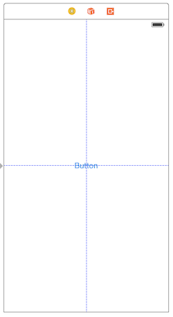
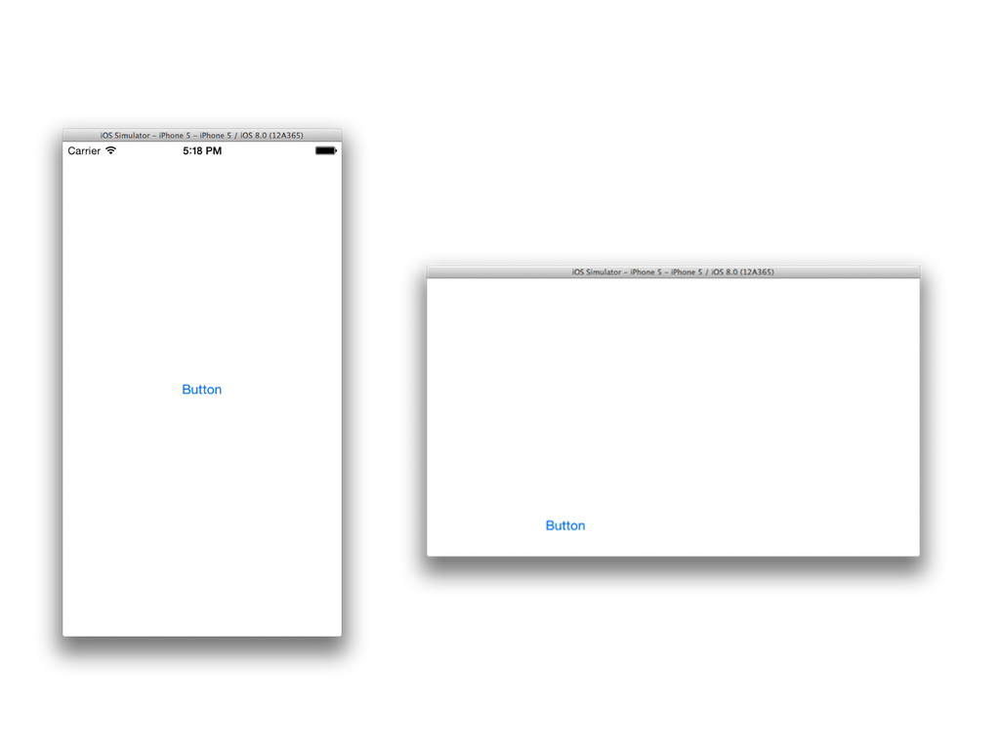
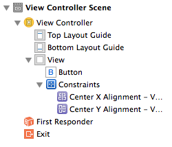
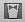
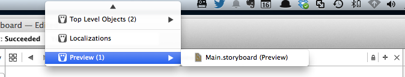
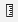

# Autolayout

## Introducción

El problema de colocar los elementos de la interfaz en unas coordenadas fijas es que si rota la pantalla o cambiamos de dispositivo, el interfaz no se va adaptar adecuadamente, ya que las dimensiones han cambiado y las coordenadas antes especificadas ahora pueden no tener sentido.

> Para que la previsualización del interfaz en Xcode tenga el mismo aspecto que las figuras, hay que desmarcar la casilla “Use size classes” del “File Inspector” \(Área a la derecha de la pantalla, primer icono\)

Por ejemplo, supongamos que queremos centrar un botón en la pantalla, tanto vertical como horizontalmente. En principio parece que basta con moverlo con el ratón hacia el centro. En el momento que el botón está centrado, aparecen unas guías punteadas que nos lo indican.



Si ejecutamos la aplicación en el simulador veremos que efectivamente está centrado. Pero si rotamos la pantalla \(tecla Cmd-Flecha izquierda\) podremos ver que cuando cambia la resolución no es así.



Necesitamos algún sistema que adapte automáticamente las dimensiones de los componentes de la interfaz a la resolución actual. En iOS ese sistema es **Autolayout**. Es un sistema declarativo y basado en restricciones. El sistema usa las restricciones especificadas para calcular automáticamente el _frame_ de cada vista de la interfaz, y adaptarlo a las dimensiones actuales de la ventana.

## Manejo de restricciones con el Interface Builder

Para especificar qué aspecto queremos que tenga la interfaz independientemente de la resolución hay que añadir **restricciones**. Básicamente las hay de dos tipos:

* **De alineación** \(_align_\): por ejemplo queremos que un botón esté centrado horizontalmente o verticalmente en su contenedor. O que varios componentes estén alineados entre sí.
* **De espaciado** \(_pin_\): por ejemplo queremos que entre un componente y otro, o entre un componente y el borde izquierdo de la pantalla haya un espacio vacío. Aquí también se incluirían las restricciones de tamaño de un componente individual. \(fijar el ancho, el alto,…\)

Hay dos formas de añadir restricciones en XCode: “haciendo clic y arrastrando” con el ratón o bien a través de la barra de herramientas de AutoLayout.

> Cuando se añaden restricciones de espaciado con respecto al borde superior e inferior de la pantalla, puede verse que en realidad no se están referenciando los bordes sino lo que Xcode llama `top layout guide` y `bottom layout guide`. La verdadera utilidad de estas guías es que se “mueven automáticamente” para dejar espacio a las barras de navegación y de botones que veremos cuando usemos _navigation controllers_ y _tab bar controllers_, asegurándonos así de que dichas barras no tapan a nuestras vistas.

### Añadiendo restricciones con botones/menús

En la parte inferior derecha del _storyboard_ hay una barra de botones específicos para autolayout


Si queremos conseguir que funcione el ejemplo anterior en el que queríamos centrar horizontal y verticalmente el botón, pulsamos sobre el icono de `Align` \(el primero\), marcamos las casillas de `Horizontal center in container` y `Vertical center in container` y pulsamos sobre el botón que ahora pondrá `Add 2 constraints` para hacer efectivas las restricciones.


Las líneas de guía, que antes aparecían punteadas, ahora serán continuas indicando que ahora son restricciones de autolayout. Dichas restricciones podemos verlas en varios sitios de Xcode:

* En el área de `Document outline`, que es accesible pulsando sobre el icono !\[\]\(Captura%20de%20pantalla%202014-10-15%20a%20la\(s\)%2018.03.41.png\) que aparece en la parte inferior izquierda del _storyboard_. Aquí podemos ver un “árbol” desplegable con las restricciones.
  * Si hacemos clic sobre una restricción, en el área de `Utilities` de la derecha de la pantalla, dentro del `Size inspector` \(el pequeño icono con una regla !\[\]\(Captura%20de%20pantalla%202014-10-15%20a%20la\(s\)%2018.09.58.png\)\) aparecerán sus propiedades, que podemos editar \(luego veremos qué significan\).
  * Si hacemos clic sobre una restricción y pulsamos la tecla `Backspace` se eliminará.



* Directamente en el `Size inspector` aparece una lista de restricciones. Cada una tiene un botón `Edit` para cambiar sus propiedades.

Las mismas operaciones también las tenemos disponibles en la opción `Editor` del menú principal, a través de los submenús `Align` y `Pin`.

### Añadiendo restricciones con el ratón

Esta forma es algo más ágil que la anterior pero requiere de cierta práctica. Cuando queremos establecer una restricción entre dos elementos **arrastramos de uno a otro manteniendo pulsada la tecla** `Ctrl` \(igual que para crear un _outlet_ o un _action_\). Cuando soltamos el botón del ratón, aparece un menú contextual donde elegir la restricción. Las opciones disponibles en el menú dependen de la dirección y sentido en que se haya arrastrado:

* Si arrastramos en sentido horizontal, podemos \(entre otros\) centrar verticalmente  \(aunque suene un poco a contrasentido\). Y al contrario si arrastramos en vertical.
* Las restricciones de espaciado serán hacia el borde que hayamos arrastrado.

### Restricciones insuficientes o contradictorias

Generalmente cuando comenzamos a añadir restricciones, las líneas que las representan aparecen en color naranja en lugar de azul. Esto sucede porque todavía **las restricciones son insuficientes** para determinar unívocamente las coordenadas del _frame_ del componente. Por ejemplo si acabamos de crear un botón y lo centramos verticalmente, lo hemos “fijado” en el eje de las `x` pero no así en el de las `y`. Además se muestra un contorno dibujado en línea punteada que indica dónde calcula Xcode que acabará posicionándose el componente con las restricciones actuales \(y que muy probablemente no sea donde nosotros queremos\).

Otro problema típico es **mover el elemento una vez se ha establecido la restricción,** de modo que no ocupa la posición que esta indica. Las líneas de restricción también aparecerán en naranja, y el número que indica su tamaño tendrá un símbolo `+` o `-` para indicar el desplazamiento.

Cuando **las restricciones son contradictorias**, las líneas que las representan aparecen en color rojo. Por ejemplo en la siguiente figura hemos intentado especificar un espaciado de 20 puntos con el margen derecho y simultáneamente que esté centrado en horizontal. Claramente esto es imposible, y así lo indica Xcode.


Cuando hay problemas con las restricciones estos se muestran también en el `Document outline` del storyboard. En el ángulo superior derecho del `Document outline` aparece una pequeña flecha roja indicando que hay problemas, y si la pulsamos aparecerá la lista de restricciones contradictorias e insuficientes.

Podemos intentar resolver estos problemas de forma automática. Para eso está el botón `Resolve autolayout issues` de la barra de botones de autolayout \(recordar que está en la esquina inferior derecha del _storyboard_\). Hay varias posibilidades:

* `Update frames`: queremos recalcular las posiciones y dimensiones de los _frames_ usando las restricciones actuales. Si hemos movido los elementos con el ratón, volverán a “su posición”.
* `Update restrictions`: si hemos movido los elementos, Xcode intentará recalcular las restricciones para que se correspondan con la posición actual.
* `Add missing constraints`: basándose en la posición actual de los elementos, Xcode intentará inferir y añadir las restricciones adecuadas para que el _layout_ deje de ser ambiguo.
* `Reset to suggested constraints`: el equivalente a eliminar todas las restricciones \(`Clear constraints`\) y luego seleccionar `Add missing constraints`.

### Previsualizar el efecto de las restricciones

Aunque podemos visualizar el efecto de las restricciones ejecutando la aplicación en el simulador, es un proceso un poco tedioso, y más si queremos comprobar el aspecto en distintos dispositivos con distinto tamaño de pantalla. Tendríamos que ejecutar el simulador para cada uno de ellos. Desde Xcode 5 existe la posibilidad de previsualizar el aspecto de la interfaz \(incluyendo por supuesto el autolayout\).

> En la versión 5 de Xcode había un botón al lado de la barra de autolayout para la previsualización, que en la versión 6 ha desaparecido.

Para previsualizar la interfaz, desde el editor del _storyboard_ seleccionamos el `Assistant editor` \(icono  de la barra de herramientas\). Como siempre sucede con este tipo de editor, el área principal se dividirá en 2. Si en la parte derecha no aparece la _preview_, la podemos seleccionar manualmente con los iconos de su zona superior



En la _preview_ se ve el aspecto que va a tener la interfaz en un determinado hardware. En la parte inferior pone el nombre, por ejemplo “iPhone 4-inch”. Si pasamos el ratón por el nombre aparecerá a su izquierda un botón que sirve para rotar la pantalla.


En la parte inferior izquierda de la ventana de _preview_ hay un símbolo `+` que sirve para añadir otros modelos de dispositivo a la previsualización.

### Restricciones sobre el tamaño

Aunque hemos dicho que autolayout calcula el _frame_ de cada componente, hasta ahora hemos ignorado el tamaño de los mismos. Centrar en horizontal y vertical elimina la ambigüedad en cuanto a en qué coordenadas “anclar” el frame pero ¿qué hay de su ancho y alto?.

Para muchos componentes \(`UILabel`, `UIButton`\) no es necesario especificar un tamaño ya que lo tienen por defecto \(el llamado “tamaño intrínseco” en el argot de autolayout\). En el API la propiedad correspondiente es `intrinsicContentSize`. Lo más habitual es que sea el tamaño del texto que contienen.

No obstante, también podemos poner restricciones sobre el tamaño. Podemos fijar el ancho y/o el alto o el _aspect ratio_. Estas son restricciones del tipo `pin` y por tanto las podemos encontrar donde encontramos las de espaciado entre componentes \(en el menú principal o en la barra de botones de autolayout\). Si usamos `ctrl-arrastrar` con el ratón bastará con que arrastremos sin salirnos del componente \(al arrastrar en horizontal se nos dará la posibilidad de finar el ancho y lo mismo con el alto si arrastramos en vertical\).

Si especificamos el tamaño mediante una restricción podemos forzar a que el contenido del botón tenga que “cortarse” porque no cabe, o bien que tenga que añadirse un _padding_ al sobrar espacio.

### Más sobre las restricciones

#### Formulación completa de una restricción

Internamente, cada restricción se formula como una ecuación lineal en la que:

```text
item1.atributo1 = multiplicador * item2.atributo2 + cte
```

Algunas restricciones no son ecuaciones sino _inecuaciones_, sustituyendo el símbolo `=` por `<=` o `>=`.

> Es decir, desde el punto de vista formal, lo que hace autolayout es resolver un sistema de ecuaciones lineales.

Estas propiedades podemos verlas en el `Size inspector` \(parte derecha de la pantalla, icono de la regla \). Si seleccionamos un componente de UI aparecerán aquí todas sus restricciones, que podemos editar pulsando en **Edit**. Por ejemplo, aquí vemos las restricciones de un botón centrado en el eje de las X y con un espaciado estándar \(8 puntos\) con respecto a la guía inferior.


Podemos observar en la figura las propiedades de la restricción, que se corresponden directamente con los coeficientes del lado derecho de la ecuación lineal \(el multiplicador y la constante\). Además aparece una _prioridad_, que explicaremos en el siguiente apartado. Haciendo clic en el desplegable con el símbolo `=` podemos cambiar la ecuación por una inecuación.

En nuestro ejemplo la constante es 0 y el multiplicador 1 porque queremos centrar el componente en el contenedor, es decir

```text
contenedor.centerX = componente.centerX
```

Podemos por ejemplo cambiar la constante por 50, con lo que conseguiremos que el componente esté desplazado 50 puntos a la izquierda de la posición de “centrado en X”.

Si en lugar de seleccionar el componente GUI seleccionamos directamente una restricción y nos vamos al `Size inspector` podremos editar directamente las propiedades de la restricción, incluyendo también los propios atributos.

#### Prioridades

Cada restricción tiene asignada una **prioridad**, que es un valor numérico que especifica su “importancia” \(a mayor valor, mayor prioridad\). El valor por defecto es 1000, que significa que el sistema entiende que la restricción **debe cumplirse**. Valores menores que 1000 indican que el sistema intentará cumplir la restricción pero que es posible que no lo haga si hay restricciones contradictorias de mayor prioridad.

Podemos cambiar/ver la prioridad actual de la misma forma que podemos cambiar/ver el resto de propiedades de la restricción \(ver apartado anterior\).

Además de las restricciones, también los componentes GUI tienen dos valores de prioridad, relativos al tamaño:

* _Compression resistance_: indica la prioridad que para el componente tiene mostrar completo su contenido \(resistiéndose por tanto a ser comprimido, y de ahí el nombre. Por defecto los componentes tienen este valor alto \(aunque menos que 1000, en Xcode 6 está fijado a 750\). Si una regla con prioridad por defecto conlleva a que el contenido del botón no se vea completo ganará la regla, pero no será así si su prioridad es menor que 750.
* _Content hugging_: indica la prioridad que para el componente tiene evitar el _padding_. Por defecto tiene un valor bajo, indicando que si hay reglas que lleven a aumentar el padding se tomarán en cuenta salvo que tengan prioridad muy baja.

## Formular restricciones usando código

En lugar de usar el editor visual del Interface Builder podemos especificar las restricciones en el código fuente. Esto puede resultar interesante en diversas situaciones: a veces los elementos de la interfaz se crean dinámicamente y por tanto no se puede especificar el _layout_ en Xcode. Otras veces puede ser que aunque los elementos del interfaz no cambien sí queramos que cambien dinámicamente las restricciones para conseguir distintos efectos de _layout_.

Hay dos formas de hacerlo: directamente con el API de autolayout o con un mayor nivel de abstracción usando el llamado “Visual Format Language”. Si podemos elegir, la mejor forma es la segunda, ya que es mucho más intuitivo especificar las restricciones y entenderlas leyendo luego el código.

### El API básico de autolayout

Cada restricción es un objeto de la clase `NSLayoutConstraint`. Para crearla se usa el método `constraintWithItem:…` que, como vamos a ver, especifica directamente parámetro por parámetro cada una de las propiedades de la restricción. Por ejemplo, supongamos que queremos centrar un componente \(que tenemos en la variable `button`\) en su contenedor \(variable `superview`\) en el eje de las X. La restricción sería algo como

```text
superview.centerX = 1*button.centerX+0
```

Donde se ha explicitado la constante y el multiplicador para ver más clara la correspondencia directa con el código, donde se haría como:

```objectivec
NSLayoutConstraint *constraint = [NSLayoutConstraint
  constraintWithItem:button
  attribute:NSLayoutAttributeCenterX
  relatedBy:NSLayoutRelationEqual
  toItem:superview
  attribute:NSLayoutAttributeCenterX
  multiplier:1.0
  constant:0.0]
```

Una vez creada la restricción para que tenga efecto hay que añadirla a la vista con `addConstraint`

```text
[self.miBoton.superview addConstraint:constraint];
```

Como vemos, hemos añadido la restricción al contenedor del botón. Como norma general, si son vistas “madre/hija” la añadiremos a la “madre”, y en otro caso _al ancestro común más cercano de ambas vistas_. Por ejemplo si fuera una relación entre dos botones dentro del mismo contenedor la añadiríamos al contenedor.

### Visual Format Language

La conversión de ecuación matemática a llamada del API es bastante directa, pero tiene el problema de que no es fácil y rápido deducir intuitivamente la restricción leyendo el código. Es mucho más intuitivo leer “el componente debe estar centrado en el eje X pero desplazado 10 pixels a la izquierda” que leer `superview.centroX = componente.centroX + 10`.

La descripción formal pero a la vez intuitiva de un conjunto de restricciones se puede hacer con una ingeniosa “representación en modo texto” de la representación gráfica de las restricciones llamada _Visual Format Language_. Dicho formato permite representar un conjunto de restricciones con una cadena de caracteres. La representación usa símbolos “semi-gráficos”, un poco al estilo del ASCII-ART \(salvando las distancias\). Así, por ejemplo si queremos especificar que entre dos componentes debe haber una separación estándar \(8 pixels\) usaríamos la cadena:

```text
[boton1]-[boton2]
```

Donde los corchetes indican un componente, y el \`\`-\`\`\` indica la separación estándar. La cadena se parece razonablemente a la representación gráfica que podríamos ver en Xcode de la misma restricción.

Hay que indicar que `boton1` y `boton2` no son exactamente nombres de variables a diferencia de cuando usamos el API de `constraintWithItem:...`, sino etiquetas arbitrarias.

La llamada al API para crear esta restricción usando el _visual format language_ sería algo como:

```objectivec
[NSLayoutConstraint constraintsWithVisualFormat:
    @“[cancelButton]-[acceptButton]”
    options: NSLayoutFormatDirectionLeadingToTrailing |
               NSLayoutFormatAlignAllCenterY
    metrics:nil
    views:viewsDictionary];
```

donde:

* el primer parámetro es la cadena de formato, como un `NSString*`
* `options` es una máscara de bits formada a partir de enumerados describiendo la dirección y la alineación de los componentes
* `metrics` se usa si hay constantes en la restricción \(no es el caso del ejemplo\). Es un diccionario en el que las claves son los nombres de las constantes y los valores son los de las constantes.
* el último, `views`, es un diccionario donde las claves son los nombres de componentes en la cadena y los valores son las variables correspondientes a las vistas. Habitualmente se usarán los mismos nombres, para simplificar, en cuyo caso podemos crear el diccionario automáticamente con `NSDictionaryOfVariableBindings`, al que le pasamos un número variable de argumentos con las variables de las vistas, por ejemplo:

```objectivec
UIButton *cancelButton = ...;
UIButton *acceptButton = ...;
NSDictionary *views = NSDictionaryOfVariableBindings(cancelButton,
                         acceptButton);
```

Algunos ejemplos adicionales de cadenas de formato:

* `[boton1]-20-[boton2]` separación de 20 puntos
* `[boton1(50)]-20-[boton2(>=50)]` entre paréntesis especificamos el ancho del botón, nótese que se pueden poner desigualdades
* `[boton1]-20@800-[boton2]` las prioridades se ponen con la `@`
* `[boton1]-20-[boton2(==boton1)]` el botón 2 debe ser del mismo tamaño que el 1.
* `V:[topField]-10-[bottomField]` con la `V` especificamos que es un _layout_ en vertical, los dos campos estarán uno encima del otro separados por una distancia de 10 puntos.
* `|-[find]-[findNext]-[findField(>=20)]-|`una línea completa de _layout_, donde las barras verticales representan los bordes del contenedor.

Se recomienda consultar la documentación de Apple para más información sobre la sintaxis y ejemplos adicionales.

> En el diseño del formato, se ha preferido la claridad y el paralelismo con la representación gráfica a la expresividad. Como resultado, ciertas restricciones no son expresables. Por ejemplo no se puede especificar que el ancho de un botón sea el doble que el de otro.

## Referencias

* [Videos de las sesiones](https://developer.apple.com/videos/wwdc/2012/) de la Apple WWDC 2012 \(requieren un id. de Apple\)
  * Introduction to Auto Layout for iOS and OS X
  * Best Practices for Mastering Auto Layout
* [Tutorial](http://www.raywenderlich.com/50317/beginning-auto-layout-tutorial-in-ios-7-part-1) de Ray Wenderlich
* [Tutorial Avanzado](http://www.objc.io/issue-3/advanced-auto-layout-toolbox.html) de Objc.io

## Ejercicios de autolayout

## Aplicación “Pioneras”

Añade _autolayout_ a la aplicación que hicistes ayer en la sesión 1 \(“Pioneras”\). El ojetivo fundamental es intentar que se vea bien en modo _portrait_ \(vertical\) independientemente del tipo concreto de iPhone \(4, 5, 6…\). Ten en cuenta que del iPhone 4 al 5 hay un cambio en la altura de la pantalla y del 5 a 6 un cambio en altura y anchura.

## layout tipo “Acordeón”

En las plantillas de la sesión hay unas cuantas imágenes de fichas de _scrabble_.El objetivo es hacer que aparezcan centradas en vertical, una al lado de la otra. Entre cada imagen debe haber una distancia fija y todas las imágenes deben tener el mismo ancho. Si el ancho de la pantalla cambia, debería cambiar automáticamente el ancho de las imágenes para que la separación siga siendo la misma.


* Crea un proyecto llamado `Autolayout`
* Añade las imágenes al `images.xcassets` como es habitual.
* Usa la interfaz visual de Xcode para poner las restricciones que consideres necesarias
* comprueba que funciona independientemente del modelo de iPhone y de la orientación \(sea _portrait_ o _landscape_\).

## _layout_ por código

En otra pantalla del _storyboard_ inserta la imagen de la `A` del _scrabble_ e intenta usando objective-c \(sin el editor visual\) que aparezca centrada en vertical y que el ancho se adapte automáticamente, dejando una distancia fija a los lados. Es decir, como el “acordeón” del ejercicio anterior, pero solo con un objeto, para simplificar.

* Pon la pantalla como controller inicial para que empiece a ejecutarse desde aquí, o crea un segue para llegar hasta ella
* crea un nuevo controller para meter el código \(una `Cocoa Touch class` que herede de `UIViewController`
* asocia el controller a esta pantalla, con el _identity inspector_

Toma como punto de partida el siguiente código, al que debes añadir el tuyo

```objectivec
//En el viewDidLoad del controller
UIImageView * imgView = [[UIImageView alloc] initWithImage:
               [UIImage imageNamed:@"a"]];
[self.view addSubview:imgView];
//no usar el método antiguo de layout (autoresizing masks)
//porque usar este junto con autolayout lleva al desastre
[imgView setTranslatesAutoresizingMaskIntoConstraints:NO];
```

