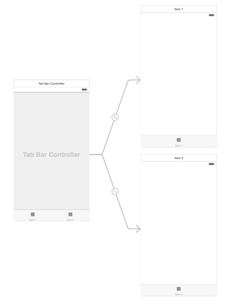

# Controladores contenedores

A diferencia de los otros tipos de _controllers_ que hemos visto, los controladores contenedores no muestran directamente el contenido “principal” de la aplicación. El papel de estos controladores es, como su propio nombre indica, el de servir de contenedores a los controladores que muestran el contenido y permitir la navegación sencilla entre ellos.

En esta parte básica de la asignatura vamos a ver los dos controladores contenedores más típicos: el _tab bar_ y el _navigation_.

## Tab bar controllers

Permiten diseñar la típica aplicación dividida por “apartados” o “tabs”. Por ejemplo lo podemos ver en la aplicación de “salud” de iOS 8 \(entre muchísimas otras\)

Lo que tenemos es un controlador de tipo “tab bar” que gestiona la barra inferior y la navegación entre pantallas cuando pulsamos cada uno de sus iconos, pero el contenido de las pantallas lo gestionan los otros controladores. Podemos ver la estructura de forma más clara si arrastramos un _tab bar controller_ al _storyboard_ desde la _object library_.

Vemos que el nuevo _tab bar controller_ aparece conectado a dos controladores convencionales \(de la clase `UIViewController`\). Automáticamente cuando pulsemos en cada icono, se saltará al controller asociado.

Podemos añadir pantallas a este _tab bar controller_ sin más que crearlas en el _storyboard_ y luego conectarlas. Hacemos `Ctrl+arrastrar` desde el _tab bar controller_ hasta la pantalla a conectar y en el menú contextual elegimos el tipo de _segue_ llamado `view controllers`.

Otra forma de crear un _tab bar controller_ relacionado con una pantalla que ya tengamos creada es seleccionar la misma y en el menú de `Editor` elegir `Embed in > Tab bar controller`. Aparecerá un tab bar controller con un único icono en la barra inferior, y ya conectado a la pantalla actual.

## Personalizar la barra inferior

Desde el _interface builder_ podemos cambiar algunas propiedades básicas de los iconos de la barra inferior en el `attribute inspector`, como el icono, el título, la posición del título con respecto al icono, si queremos que aparezca un _badge_, etc.

> Si elegimos uno de los iconos del sistema no podremos cambiar el título ya que Apple considera que lo contrario podría inducir a confusión al usuario

Si queremos personalizar el icono poniendo nuestra propia imagen hay que tener en cuenta que los iconos de un _tab bar_ son monocromáticos. El formato a usar es .png, del que el sistema examinará el canal alfa o de transparencia. Tomará como forma del icono los pixels que sean opacos ignorando su color. Podéis consultar más detalles sobre el formato y el tamaño recomendado en el apartado “[Bar button icons](https://developer.apple.com/library/ios/documentation/userexperience/conceptual/MobileHIG/BarIcons.html#//apple_ref/doc/uid/TP40006556-CH21-SW1)” de las [_iOS Human Interface Guidelines_ ](https://developer.apple.com/library/ios/documentation/userexperience/conceptual/mobilehig/) de Apple.

## Navigation controllers

Los _navigation controller_ sirven para crear estructuras de navegación jerárquica en las que tenemos pantallas y “subpantallas”. Estando en una de ellas podemos volver atrás una a una. El _navigation controller_ se encargará de que se vaya cambiando automáticamente al controlador apropiado \(el de la pantalla actual\).

Nótese que cuando estamos navegando de este modo estamos usando una **pila de controladores**, en el sentido que tiene este término en estructuras de datos, ya que conforme vamos profundizando en la jerarquía se van apilando los controladores, y cuando volvemos atrás quitamos el de la parte de arriba de la pila.

## Crear un controlador de navegación

Hay dos formas de crear gráficamente un controlador de navegación:

1\) Seleccionamos un _controller_ en el _storyboard_ y elegimos la opción de menú de `Editor > Embed in > Navigation controller`. Se creará un controlador de navegación que tiene como controlador de contenido asociado al que habíamos seleccionado.

Nótese que como en el caso de los _tab bar controller_ en el de navegación la pantalla está en gris indicando que el contenido no es responsabilidad de este controlador. En el controlador de contenido asociado podemos ver que la parte superior aparece en gris, indicando que esta es la _barra de navegación_ que gestionará el controlador de navegación.

2\) Podemos arrastrar un `Navigation controller` desde la librería de objectos hasta el _storyboard_. Por defecto nos creará el controlador de navegación junto con un controlador de tabla, estructura apropiada para comenzar con una vista maestro/detalle. No obstante si no queremos este segundo controlador podemos borrarlo y conectar el de navegación con uno nuevo con `Ctrl+Arrastrar` entre ambos y seleccionando en el menú contextual la opción de `root view controller` bajo `relationship segue`.

### Añadir pantallas a la jerarquía

Para añadir un controlador a la jerarquía de navegación basta con `Ctrl+Arrastrar` entre el componente que dispararía el salto y el controlador de destino. En el menú contextual hay que elegir el _segue_ de tipo _push_. Evidentemente el controlador de origen tiene que estar ya en la jerarquía de navegación para que esta operación funcione.

## Personalizar la barra de navegación

Automáticamente el controlador de navegación gestionará una barra de navegación en la parte superior de la pantalla. Esta barra muestra por defecto en su parte izquierda un botón `< Back` para ir al controlador anterior.

La barra de navegación es totalmente personalizable. Lo más inmediato es mostrar un título para la pantalla actual cambiando la propiedad `title` del controlador. Podemos hacerlo por ejemplo en el método `viewWillAppear` del mismo, ya que se ejecutará antes de mostrar la vista. Al cambiar el título del controlador también cambiará automáticamente el botón \`\`&lt; Back\`\`\` para reflejar el nuevo título.

> Si el título del _controller_ es demasiado largo y no cabe en el botón este seguirá con el título por defecto \(`Back`\)

Podemos cambiar completamente la barra de navegación. Es accesible mediante la propiedad `navigationItem` del controlador, y podemos cambiar por ejemplo:

* `backBarButtonItem`: el botón, de tipo `UIBarButtonItem`, que se utilizará para volver atrás a este controlador
* `titleView`: el componente con el título para el controlador, cuyo texto como hemos visto podemos cambiar con la propiedad `title` del controlador.
* `rightBarButtonItem`: por defecto `nil`. Típicamente se usa para añadir un botón para editar el contenido de la pantalla actual, pero podemos colocar lo que queramos.

