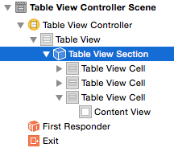
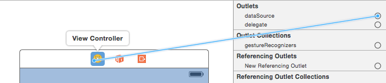

# Tablas básicas

## Introducción

Las vistas de tabla \(`UITableView`\) se encargan de mostrar, gestionar y hacer _scrolling_ de una tabla de elementos de una sola columna. Cada una de las filas se modela con un `UITableViewCell`.

> Si necesitamos más de una columna podemos usar `UICollectionView`, que veremos en la parte “avanzada” de la asignatura.

El aspecto de las tablas es enormemente configurable, lo que hace que aparezcan múltiples veces en sus distintas “encarnaciones” en muchas aplicaciones iOS, por ejemplo, en las aplicaciones de Mail, Ajustes, Reloj…

Las tablas pueden ser _simples_ \(`UITableViewStylePlain`\) o _agrupadas_ \(`UITableViewStyleGrouped`\)

Hay varios estilos predefinidos para las filas, que nos permiten mostrar diversos elementos: título, subtítulo, icono a la izquierda, … También podemos crear nuestros propios estilos de celda bien por código o bien gráficamente en el _interface builder_.

## Creación de vistas de tabla

Una vista de tabla interactúa básicamente con tres objetos \(aunque podemos implementar todas las funcionalidades en una única clase, como se suele hacer en los casos más simples\)

En primer lugar, el _view controller_. Ya hemos visto el papel que hace en las aplicaciones.

En segundo lugar, el _data source_: las vistas de tabla solo almacenan directamente los datos de las filas actualmente visibles en pantalla. El resto se los piden a un objeto que debe ser conforme al protocolo `UITableViewDataSource`. Este es obligatorio, no podemos crear una tabla sin él.

Y finalmente el _delegate_: para gestionar algunos eventos de manipulación de la tabla \(como la edición, el borrado, o el mover una fila\) y controlar algunos aspectos de la apariencia de las celdas, se usa el `UITableViewDelegate`

Es muy habitual que el _controller_, el _delegate_ y el _data source_ sean el mismo objeto.

Si usamos una vista de tabla dibujada en el _storyboard_ podemos conectarla con los dos “colaboradores” gráficamente mediante el “Connections Inspector” del panel “Utilities”

## Tablas estáticas

En algunos casos conocemos de partida los elementos que queremos dibujar en la tabla. Ejemplo típico de esto es la aplicación de _Ajustes_, en la que las opciones están colocadas en una tabla simplemente para que estén más organizadas y tengan un formato atractivo. Esto lo podemos conseguir con una _tabla estática_.

Para crear una pantalla con una tabla estática arrastramos un `Table View Controller` al _storyboard_. Es un _controller_ asociado a una vista de tabla que ocupa toda la pantalla del dispositivo. Por defecto usa una tabla dinámica, pero podemos cambiarlo seleccionando la tabla en el `Attributes inspector` y seleccionando `Static Cells` en la primera propiedad, `Content`.

Podemos añadir secciones a la tabla y cambiar el número de celdas en cada sección. Para poder cambiar el número de celdas hay que tener seleccionada la sección deseada, lo que a veces es difícil con el ratón, por lo que podemos usar los nodos del `Document outline`:



> Podemos aumentar el número de celdas de modo que no quepan en la pantalla. Para desplazarnos por la tabla podemos seleccionarla y hacer _scroll_ con la rueda del ratón

## Dibujar tablas dinámicas

El encargado de decirle a la vista de tabla qué contenido debe dibujar es el _datasource_. Este puede ser el objeto que nosotros queramos con tal de que implemente el _protocol_ `UITableViewDataSource`. Habitualmente será el _controller_ de la pantalla en la que está la tabla.

### Conectar la tabla y el _datasource_

Podemos conectar gráficamente la tabla con el _datasource_ mediante el `Connections inspector` \(el icono de la flecha - el último - en el área de `Utilities`\). Si tenemos seleccionada la tabla aparecerán las propiedades que podemos conectar, entre ellas el `datasource`. Arrastramos \(no hace falta `Ctrl`\) desde el círculo que representa al `datasource` hasta el icono del _view controller_ \(el primero de los tres que aparecen en la parte superior de cada pantalla del _storyboard_\)



### Implementar los métodos del protocolo `UITableViewDataSource`

Como mínimo el objeto que actúe de _datasource_ debe implementar dos métodos:

* `tableView:numberOfRowsInSection:` que debe devolver el número de filas que tiene una determinada sección \(de la única si solo hay una\)

```objectivec
- (NSInteger)tableView:(UITableView *)tableView numberOfRowsInSection:(NSInteger)section {
    //supongamos que la propiedad "datos" es un array con los datos de la tabla
    return [self.datos count];
}
```

* `tableView:cellForRowAtIndexPath:` debe devolver la celda correspondiente a un determinado número de fila y sección. Este merece una discusión más detallada que el anterior

Lo más simple sería construir un nuevo objeto `UITableViewCell` por cada fila:

```objectivec
- (UITableViewCell *) tableView:(UITableView *)tableView cellForRowAtIndexPath:(NSIndexPath *)indexPath {
    //Construimos la celda y le damos un estilo de los predefinidos
    UITableViewCell *celda = [[UITableViewCell alloc] initWithStyle:UITableViewCellStyleDefault reuseIdentifier:@"UnaCelda"];
    //Instanciamos el texto de la celda
    celda.textLabel.text = self.datos[indexPath.row];
    return celda;
}
```

Aclaraciones:

* un objeto `indexPath` especifica el número de fila \(`row`\) y de sección \(`section`\) con las propiedades del mismo nombre.
* En un momento veremos qué es el `reuseIdentifier` del método inicializador de la celda. Por ahora simplemente le asignamos un `NSString` arbitrario

> Nota: el código anterior no se suele implementar tal cual en la realidad. Sería muy ineficiente por las razones que veremos a continuación.

* Crear una nueva celda por cada fila es muy ineficiente dado que una tabla puede tener cientos o miles de ellas. Por eso se suele usar un truco ingenioso: se crea un pequeño número de celdas \(las que se ven simultáneamente en pantalla\) y luego se reutilizan conforme se va haciendo _scroll_ por la tabla, rellenándolas con los nuevos datos. iOS ofrece soporte para esta reutilización manteniendo un _pool_ de celdas que podemos reutilizar para rellenar con nuevos datos.
  * Podemos sacar una celda del _pool_ con `dequeueReusableCellWithIdentifier:`.
  * El identificador sirve para etiquetar el “tipo” de celda. En casos más complicados podríamos tener varios _pool_ con distintos tipos de celda para reutilizar. En el ejemplo usaremos un único identificador \(es arbitrario y lo elige el desarrollador\)

```objectivec
- (UITableViewCell *) tableView:(UITableView *)tableView cellForRowAtIndexPath:(NSIndexPath *)indexPath {
    //Solicitamos una celda del "tipo" desedo al "pool"
    //Esto es mucho más rápido que crearlas desde cero
    UITableViewCell *celda = [tableView dequeueReusableCellWithIdentifier:@"UnaCelda"];
    //si nos ha devuelto nil es que no habían celdas disponibles.
    //Tendremos que crear una, como hacíamos antes
    if (celda == nil) {
        celda = [[UITableViewCell alloc] initWithStyle:UITableViewCellStyleDefault reuseIdentifier:@"UnaCelda"];
    }
    //Igual que antes rellenamos los datos y devolvemos la celda
    celda.textLabel.text = self.datos[indexPath.row];
    return celda;
}
```

* Si cambiamos el conjunto de datos a mostrar en la tabla, para que los cambios se reflejen en la pantalla deberemos llamar al método `reloadData` de la vista de tabla.

## Gestión de tablas

En las tablas dinámicas podemos por supuesto insertar y eliminar celdas. También podemos seleccionarlas haciendo _tap_ sobre ellas. El encargado de procesar todas estas tareas es el _delegate_ de la tabla

### Seleccionar celdas

Cuando se selecciona una celda, el _delegate_ recibe el mensaje `tableView:didSelectRowAtIndexPath:`

```objectivec
- (void) tableView:(UITableView *)tableView didSelectRowAtIndexPath:(NSIndexPath *)indexPath {
    UITableViewCell *celda = [tableView cellForRowAtIndexPath:indexPath];
    //Colocamos un "checkmark" en la celda o lo quitamos si ya estaba
    if (celda.accessoryType==UITableViewCellAccessoryNone)
        celda.accessoryType = UITableViewCellAccessoryCheckmark;
    else
        celda.accessoryType = UITableViewCellAccessoryNone;
    //Hacemos que la celda se deseleccione visualmente
    [tableView deselectRowAtIndexPath:indexPath animated:YES];
}
```

### Insertar y eliminar filas

iOS nos ofrece de forma automática el “modo edición” en el que en cada celda aparece una señal de “prohibido” para poder borrarla \(pulsando sobre la señal y luego sobre el botón “Borrar” que aparece\). Podemos activar este modo con el método `setEditing`:

```objectivec
//"miTabla" es un outlet a la vista de tabla
[self.miTabla setEditing:YES animated:YES];
```

Aunque el modo edición es automático, el borrado efectivo de las celdas y de su contenido lo tenemos que hacer nosotros, al igual que la inserción. Podríamos usar un código similar al siguiente:

```objectivec
 (void) tableView:(UITableView *)tableView
              commitEditingStyle:(UITableViewCellEditingStyle)editingStyle
              forRowAtIndexPath:(NSIndexPath *)indexPath {
    //si el usuario ha pulsado sobre borrar
    if (editingStyle == UITableViewCellEditingStyleDelete) {
        //Nos cargamos el objeto de la lista de valores
        //IMPORTANTE: hay que borrar primero del modelo antes que
        //la celda de la tabla
        [self.datos removeObjectAtIndex:indexPath.row];
        //lo borramos visualmente de la tabla
        [tableView deleteRowsAtIndexPaths:[NSArray arrayWithObject:indexPath]
                    withRowAnimation:UITableViewRowAnimationFade];
    }
   //si está insertando una nueva fila
    else {
        NSString *nuevoTexto = self.miCampo.text;
        [self.datos insertObject:nuevoTexto atIndex:indexPath.row];
        [tableView insertRowsAtIndexPaths:[NSArray arrayWithObject:indexPath]
                         withRowAnimation:UITableViewRowAnimationAutomatic];
    }
}
```

Podemos controlar cómo queremos que aparezca cada celda en el “modo edición”

```objectivec
- (UITableViewCellEditingStyle) tableView:(UITableView *)tableView
                editingStyleForRowAtIndexPath:(NSIndexPath *)indexPath {
    //En la última celda hacemos que aparezca un icono de "insertar"
    if (indexPath.row==[self.datos count]-1)
        return UITableViewCellEditingStyleInsert;
    //En el resto que se puedan borrar
    else
        return UITableViewCellEditingStyleDelete;
}
```

