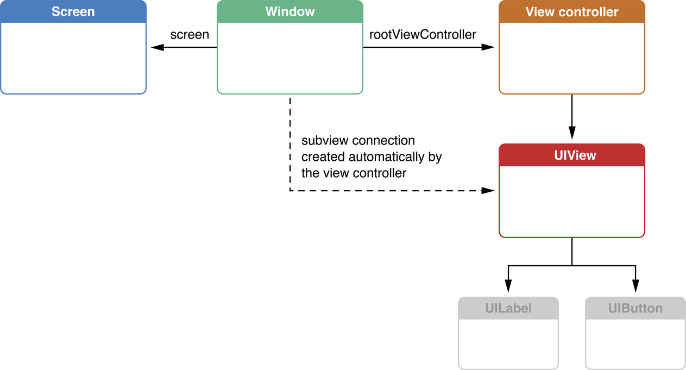
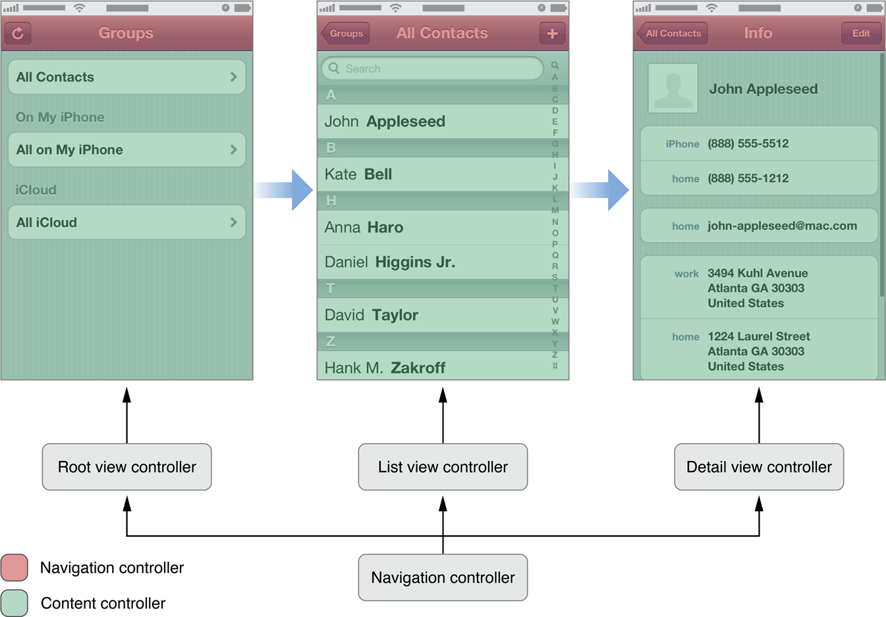
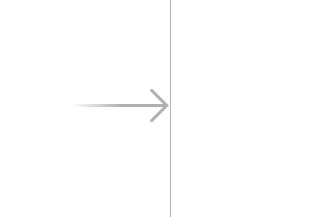

# View controllers

## _View controllers_. Tipos básicos

Los _view controllers_ son la C del MVC. Actúan como el “pegamento” que relaciona la vista con el modelo. El controlador es el lugar típico para poner el código que reacciona a los eventos del usuario. Por ejemplo qué hacer cuando se pulsa un botón.

En cada momento hay un _root view controller_, que es el “principal”. En los casos más simples, una pantalla de nuestra aplicación tendrá un único _view controller_. En general, un controlador puede tener a su vez controladores “hijos”, como veremos.



Hay dos tipos básicos de controladores: los que muestran directamente contenido \(_content controllers_\) y los que contienen otros contenedores \(_container controllers_\).



Cuando se usan _storyboards_ no tenemos que preocuparnos de instanciar el controlador adecuado, el proceso es automático. También el controlador se asocia automáticamente a la vista que hemos definido en el _Interface Builder_.

## Instanciar controladores y vistas

Podemos hacerlo de varias formas. De más sencilla a más compleja \(pero también más flexible\)

* **Gráficamente, con** _**storyboards**_: tanto las vistas como el controlador están en el _storyboard_
  * **Gráficamente, con** `.nib`: en cada archivo `nib` guardamos una pantalla \(con su jerarquía de vistas\), pero no el controlador, que se crea por código
* **Totalmente por código**: tenemos que instanciar el controlador y en su método  `loadView` crear la jerarquía de vistas que queremos que contenga \(`UIView`, `UIButton`, lo que sea\) y asignar la raíz de la jerarquía de vistas a `self.view`.

En los siguientes apartados vamos a ver cada una de estas posibilidades con algo más de detalle.

## Storyboards

Desde Xcode 5 los _storyboards_ son la forma recomendada por Apple de crear interfaces de usuario. Un _storyboard_ contiene la representación gráfica de las “pantallas” \(los controladores\) que componen nuestra aplicación y de las relaciones entre ellas. Además el sistema se encarga automáticamente de moverse por las pantallas cuando sucedan determinados eventos, instanciando los controladores y las vistas automáticamente.

### El _controller_ inicial

En cada momento habrá un _view controller_ inicial que es el que se muestra cuando se carga la aplicación. Se distingue visualmente porque tiene una flecha apuntando a él desde la izquierda:



Para **convertir un** _**view controller**_ **en inicial**, teniéndolo seleccionado ir al icono de propiedades  del área de `Utilities` y marcar sobre el _checkbox_ `Is initial view controller`


También podemos arrastrar la flecha que indica que un controlador es el inicial desde el actual hasta el que queremos convertir en inicial.

### Segues

Son las transiciones entre los _view controllers_. Podemos **crear un** _**segue**_ **visualmente** con `Ctrl+Arrastrar` entre un elemento cualquiera de un view controller \(por ejemplo un botón\), que será el de _controller_ de origen, y el _controller_ destino. Se nos dará a **elegir el tipo de** _**segue**_ en un menú contextual. Si es un _controller_ de contenido el típico es `modal` \(o también `popover` en iPad\). El tipo `push` es para controladores de navegación, y el `custom` para escribir nuestro propio tipo.

Podemos **configurar las propiedades del** _**segue**_ haciendo clic sobre él y yendo al icono de propiedades  del área de `Utilities`. Aquí podemos cambiar el tipo y también la transición usada para navegar de una pantalla a otra.

#### Pasar datos de un _controller_ a otro en un _segue_

Cuando se va a saltar de un _controller_ a otro a través de un _segue_, se llama al método `prepareForSegue:sender:` del _controller_ origen. Podemos sobreescribir este método para pasarle datos al _controller_ destino. El primer parámetro va a instanciarse al _segue_ y a partir de este podemos obtener una referencia al destino.

```objectivec
- (void) prepareForSegue:(UIStoryboardSegue *)segue sender:(id)sender {
    //Suponemos que el controller destino es de la clase "ViewController2"
    ViewController2 *destino = [segue destinationViewController];
    //Suponemos que la clase "ViewController2"
    //tiene una @property NSString *texto
    destino.texto = @"Hola, soy el controller origen";
}
```

#### Volver atrás en un _segue_

Una cosa que no podemos hacer visualmente sin escribir algo de código es volver a la pantalla anterior cuando hemos seguido un _segue_. Para conseguirlo tenemos que hacer dos cosas:

La primera, implementar en el _controller_ al que se vuelve un método que puede tener el nombre que deseemos pero debe devolver un `IBAction` y tener como único parámetro un `UIStoryboardSegue *`. Por ejemplo

```objectivec
- (IBAction)miUnwind:(UIStoryboardSegue *)segue {
    NSLog(@"Vuelta atrás!!");
}
```

Ahora en la pantalla del _storyboard_ desde la que volvemos conectamos con `Ctrl+Arrastrar` entre el elemento de interfaz que debe producir el _unwind_, y el icono de `Exit` que aparece en la parte de arriba.


> Si intentamos hacer esta operación de `Ctrl+Arrastrar` sin haber implementado el método anterior, veremos que no tiene efecto

En el método del _unwinding_, nótese que podemos usar el parámetro, que es el _segue_, para obtener el `destinationController`, que ahora será el _controller_ al que volvemos. También podemos acceder al _controller_ desde el que volvemos en la propiedad `sourceController`.

Finalmente, decir que cuando se produce un _unwind_, el controlador desde el que se vuelve también recibe una llamada a `prepareForSegue:sender`, método que podemos sobreescribir si queremos aprovechar para realizar alguna operación antes de volver.

## NIBs

Un archivo NIB \(o `.xib`, en un momento veremos la diferencia\) contiene la jerarquía de vistas asociada a un determinado _view controller_, pero normalmente no se crea de manera manual, sino visualmente con el Interface Builder. De hecho, el nombre significa “NeXT Interface Builder”, referenciando la famosa plataforma [NeXTSTEP](http://en.wikipedia.org/wiki/NeXTSTEP) de la que hereda y es deudora Cocoa.

Hasta que apareció iOS 5 los NIB eran la forma habitual de crear interfaces de usuario, pero por defecto las últimas versiones de Xcode \(desde la 5, correspondiéndose con iOS7\) usan _storyboards_. Nótese que un NIB contiene únicamente “una pantalla” de nuestra aplicación y que por tanto es responsabilidad del desarrollador cambiar de un controlador a otro y cargar el NIB correspondiente conforme se va navegando.

Un archivo .xib, que es lo que vemos en la lista de archivos de proyecto en Xcode, es básicamente un NIB serializado en forma de XML, lo que podemos comprobar haciendo _clic_ sobre él con el botón derecho en Xcode y seleccionando `Open as` &gt; `Source code`.

En Xcode podemos crear un NIB de dos formas:

* Crear un controller y automáticamente un NIB asociado
* Crear directamente el NIB y luego asociarle manualmente un controller

En la primera de las posibilidades nos iríamos a crear la nueva clase del _controller_ \(una `cocoa touch class`\). Especificaríamos que hereda de `UIViewController` y marcaríamos la casilla de `Also create XIB File`.

Como el controlador y el NIB están asociados por defecto, para cargar la pantalla con la jerarquía de vistas basta con cargar el controlador:

```objectivec
MiViewController *mvc = [[MiViewController alloc] init];
//pasamos a este controller
self.window.rootViewController = mvc;
```

En el segundo caso \(asociación “manual”\), cuando inicializamos el controlador debemos especificar qué NIB debe cargar

```objectivec
EjemploViewController *evc =
  [[EjemploViewController alloc] initWithNibName:@"ejemplo" bundle:nil];
self.window.rootViewController = evc;
```

## Ejercicios de _view controllers_

Vamos a hacer una aplicación que vamos a llamar “Pioneras”, y que nos dará datos de algunas mujeres pioneras de la informática. La aplicación tendrá una pantalla principal en la que aparecerán sus imágenes, y haciendo _tap_ sobre cada una podremos ir a las pantallas secundarias donde se nos dará más información.

### Realizar la estructura básica de la aplicación

1. En la carpeta `sesion1/recursos/` de las plantillas tenemos las imágenes de las tres pioneras: Ada Lovelace, Grace Hopper y Barbara Liskov, que como siempre **arrastraremos al** `images.xcassets`. También tenemos los textos sobre ellas que se mostrarán en las pantallas secundarias.
2. Crea tres botones en la pantalla principal, y para cada uno de ellos en lugar de texto vamos a usar como imagen de fondo la de cada mujer. Al final cada botón debería ocupar todo el ancho de la pantalla y un tercio del alto.
3. Arrastra un nuevo “view controller” al storyboard \(una “pantalla” nueva\), que será el que aparezca cuando se pulse en el primero de los botones \(el de Ada Lovelace\). Inserta un campo de texto de varias líneas \(_text view_\) y copia en él el contenido de `sesion1/recursos/lovelace.txt`
4. Ahora **establece el** _**segue**_ **entre las dos pantallas**: haz `Ctrl+Arrastrar` desde el primero de los botones con la imagen de Ada Lovelace hasta la segunda pantalla. En el menú contextual elige el tipo `modal`, **ya que los otros no funcionarán**.
   * Si haces _clic_ en el _segue_ y vas al _Attribute inspector_ puedes cambiar las propiedades, pero tal como está hecha la aplicación solo va a tener efecto la `transition`. Pon el valor que quieras, salvo `partial curl` que puede dar problemas a la hora de volver atrás en el _segue_.
   * Ejecuta el proyecto para comprobar que funciona lo que has hecho, aunque _todavía no puede volver atrás desde la pantalla secundaria_
5. Implementa la opción de **volver atrás** de la secundaria a la principal
   * Crea un botón “atrás” en la secundaria y colócalo en la parte de arriba \(para que no lo tape el teclado _on-screen_ si aparece\)
   * En el _controller_ destino crea un método para que funcione el _unwinding_ \(no hace falta que haga nada, solo que exista\)

```objectivec
- (IBAction)retornoDeSecundaria:(UIStoryboardSegue*)segue {
}
```

* Con `Ctrl+Arrastrar` conecta el botón “atrás” con el icono de “Exit” de la parte superior del _controller_
  * Ejecuta el proyecto y comprueba que puedes volver atrás desde la pantalla secundaria
* Repite lo que has hecho en el caso de Ada Lovelace para las otras dos mujeres, creando las pantallas secundarias y la navegación adelante y atrás.

## Comunicar un _controller_ con otro

Es un poco redundante tener tantas pantallas secundarias cuando en realidad lo único que cambia es el texto a mostrar. Valdría con una sola secundaria en la que cambiáramos dinámicamente dicho texto. Vamos a implementarlo así.

### Guardar la versión actual del proyecto para que no se pierda

Lo primero es guardar una copia del estado actual del proyecto. Hay dos posibilidades:

* con `git` podemos crear una etiqueta o _tag_ que nos marque la versión actual del proyecto para poder recuperarla luego. No obstante Xcode no nos permite gestionar _tags_, por lo que, **tras asegurarnos de que hemos hecho commit y push de todos los cambios actuales**, haríamos desde la terminal \(estando dentro del repositorio\):

```bash
    git tag v1.0   (etiquetamos el commit actual)
    git push origin v1.0 (subimos la etiqueta al repositorio remoto)
```

* Otra posibilidad es crear una copia manual de los ficheros del proyecto y guardarlo en una carpeta `v1.0` de las plantillas

Ahora podéis eliminar los segues y las pantallas secundarias, es mejor crearlos de nuevo.

### Crear la nueva interfaz

* Crea de nuevo una pantalla secundaria con un campo de texto de varias líneas
* Con `Ctrl+arrastrar` podemos crear un _segue_ desde cada uno de los botones hasta la pantalla. Habrán tres _segues_ que lleguen a la misma, no debería ser problema.
* Añádele a la pantalla el botón de “atrás” y conéctalo con el icono de “exit”. El código necesario para el _unwinding_ \(método `retornoDeSecundaria`\) ya debería estar en el `ViewController.m`
* Comprueba que la navegación funciona correctamente yendo adelante y atrás

### Crear un controlador personalizado para la pantalla secundaria

Si en la parte derecha de la pantalla miras el _identity inspector_ verás que el controlador de la pantalla secundaria es un tipo propio de Cocoa, el `UIViewController`. Vamos a cambiarlo por uno propio

1. Crea una nueva clase de Cocoa Touch, \(File&gt; New &gt; File…, plantilla “cocoa touch class”\). En la segunda pantalla del asistente dale a la clase el nombre `SecundarioViewController` y haz que sea una subclase de `UIViewController`. Deja sin marcar la opción de crear el .XIB
2. En el _storyboard_, selecciona el _controller_ de la pantalla secundaria \(es mejor que lo hagas pulsando en el primero de los iconos que aparecen en  la parte superior\)

   

3. Una vez seleccionado, ve al _identity inspector_ en el área de `Utilities` y en el apartado de `Custom class` selecciona como clase la que has creado, `SecundarioViewController`

### Añadirle un _outlet_ al controlador secundario

Tienes que añadir un _outlet_ al campo de texto para que su contenido se pueda cambiar desde el controlador secundario. Hazlo como habitualmente, con ctrl+arrastrar entre el campo y el `SecundarioViewController.h`, en el `assistant editor`.

### Hacer que el texto cambie según el botón pulsado

* Lo primero es añadir físicamente los ficheros `*.txt` con los textos al proyecto para que se puedan cargar dinámicamente por código. Pulsa con el botón derecho sobre el proyecto y selecciona `Add files to Pioneras`. Selecciona los tres `.txt`, que se añadirán al proyecto
* Para que le podamos decir al controlador secundario qué fichero tiene que abrir, vamos a crear una `@property` en el `SecundarioViewController` llamada `nomFich` de tipo `NSString*`

  //En el SecundarioViewController.h @property NSString \*nomFich;

* Para establecer una asociación sencilla entre cada segue y los datos a mostrar puedes usar el identificador del _segue_. Haz clic sobre él y en el `Attributes inspector` cambia su `identifier`, respectivamente por `lovelace`, `hopper` y `liskov`
* ahora en la clase `ViewController`, que es el controlador de la pantalla principal, puedes implementar el `prepareForSegue:sender`

```objectivec
//En el ViewController.m
-(void)prepareForSegue:(UIStoryboardSegue *)segue sender:(id)sender {
    SecundarioViewController *svc = segue.destinationViewController;
    //El fichero a cargar se corresponde con el identificador del segue
    svc.nomFich = segue.identifier;
}
```

* Finalmente, en el `viewDidLoad` del `SecundarioViewController` puedes acceder a la propiedad `self.nomFich`, cargar el texto del fichero y mostrarlo en el campo de texto.

```objectivec
//Sacamos el path completo el fichero
NSString *filePath = [[NSBundle mainBundle] pathForResource:self.nomFich                                                 ofType:@"txt"];
NSError *error;
NSString *textoFich;
if (filePath) {
    //Leemos el fichero y guardamos su contenido en un NSString*
    textoFich = [NSString stringWithContentsOfFile:filePath
                          encoding:NSUTF8StringEncoding
                          error:&error];
//HAY QUE CAMBIAR self.campoTexto POR COMO HAYAIS LLAMADO AL OUTLET!!!!!
if (!error) {
    //Si todo es OK, mostramos la cadena en el campo de texto
    self.campoTexto.text = textoFich;
}
```

